## 静态页面与交互实现细节 🤝

#####作者：宣正吉
**梗概：** 包含静态页面组织的组件和外观设计、图片设计和优化等内容细节，也包含具体的时间安排。

---

### 时间节点

**4/10~4/13** 预计 5~6 天完成所有静态页面的编写和设计，根据功能与需求分析文档，需要完成主页面基础组件 + 固定页面、主要功能页面、附加功能页面几个部分，工作时间分配大致安排：

| 时间分配 |      具体时段      |         完成内容          |                     包含的页面内容                     |
| :------: | :----------------: | :-----------------------: | :----------------------------------------------------: |
|   2 天   |  4/10 日~4/11 日   | 主页面基础组件 + 固定页面 | 侧边导航栏 + 顶部功能栏 + 登录窗口 + 信息栏 + 无效链接 |
|   2 天   |  4/12 日~4/13 日   |       主要功能页面        |                  酒店 + 火车票 + 旅游                  |
|  1~2 天  | 4/14 ~ **4/15** 日 |       附加功能页面        |             机票 + 汽车票·船票 + 我的订单              |

### 基础组件 + 固定页面

脚手架采用`next.js`的初始化方案`npx create-next-app@latest`，执行`npm run dev`在开发环境下运行，且该脚手架支持`tailwindcss`，非常方便。

#### 侧边导航栏

这个部分实际上要搭配右侧内容宽度进行布局，因此需要先用 antd 做整体布局效果，选择 antd 中已经存在的布局，利用 `vh` 做全屏伸缩布局：

左侧是导航栏，右侧是内容区域。

左侧导航栏用既有组件`Menu`实现，组件在 sider 文件夹的`sider.js`中，共有 9 个一级标签页，二级标签页内容暂时待定，可从后台 mock 数据当中抽取。每个标签页都有独立的`id`属性，这部分数据后面在实现功能的过程中还可以抽取数据，用代码生成，所以不用写太多假数据，实现效果：

 **好奇功能：** 似乎导航栏利用的不是 antd 组件，是怎么实现的呢？

导航栏中的图标采用阿里巴巴矢量图标库`iconfont`实现，`antd`支持引入网络 icon，可以链接阿里巴巴图标库进行开发。
实现效果：

导航栏上方设计一个按钮，点击按钮，整个菜单会折叠成简约版本，鼠标移入则展开成完全版本。可以通过`antd`中的收起内嵌菜单实现，只需要修改`Menu`组件的一个参数和添加一个控制折叠的 js 代码即可。

但需要注意的是，这个折叠组件需要作为状态放在外面的布局`Side`组件中，传递给子组件通过 button 改变状态，因为这个布局特性是外部 layout 独有的。

实现效果：
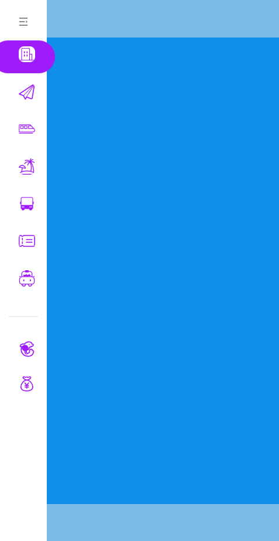
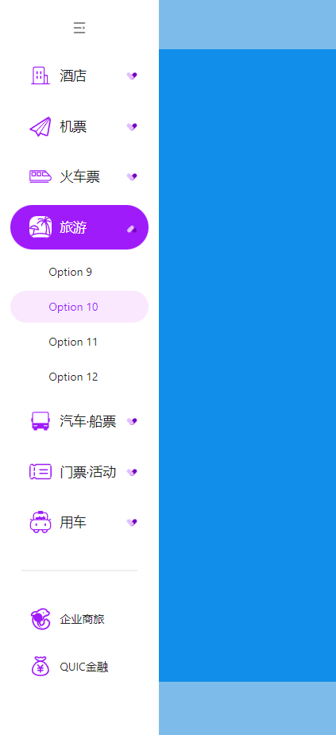

#### 顶部功能栏

最左侧是我们的 LOGO，LOGO 是我自己设计的，引入效果如下，上边栏在 pages 的 toper 文件夹中，叫做`Toper`。
功能栏采用 flex 布局，利用各种组件实现，包含弹窗、下拉菜单两种主要组件。
其中通过修改弹窗组件的内容部分可以产生多样布局的泡泡弹窗。
实现效果：
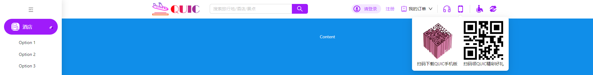

为了提高用户体验，搜索功能希望在输入内容后，按下键盘 Enter 键能够触发搜索操作，事件绑定到`keyUp`操作中。但是我们在前端中并没有涉及到搜索操作的实现，所以这里在按下 enter 键时，显示一个提示泡泡在最上方，标记我们按下了 enter 键。

#### 登录弹窗

登录弹窗组件可以直接放在工具栏当中，因为登录操作不需要从父组件获得任何信息，只需要改变 cookie 当中的存储状态即可。这里把登录按钮更改为下拉菜单的形式，可通过点击注销退出 cookie 登录的状态。用户名和密码的状态也可以保留在工具栏组件当中。

**cookie 存储的流程：**

由于登录的部分内容还有很多，准备将登录作为一个独立组件。

点击登录按钮，弹出提示框，输入用户名和密码，点击登录按钮。

第一次登录时，检验用户名密码（==后期要 mock，将此部分更改为请求响应模式==），如果符合要求，则“请登录”变为欢迎！+ 用户名，并将 token 存储在 cookie 中，

==这里把右侧二维码改为 antd 的二维码控件，能够自动把 url 转换为二维码。==

##### 登陆部分

登录分为 3 类：用户名密码登录、手机号登录和扫码登陆。

**用户名密码登录：** 输入用户名和密码，发送到后台校验，校验成功后保存到本地 cookie，而后

**手机号登录：** 此登录方法校验可手机号，通过设置校验规则的正则表达式实现。

**扫码登陆：** 仍然采用之前生成二维码的组件。

最终效果：

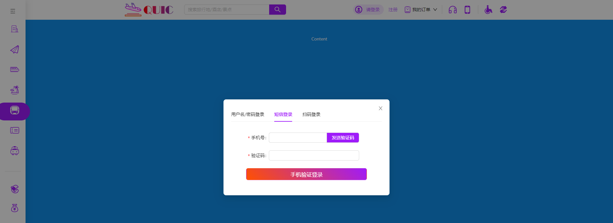
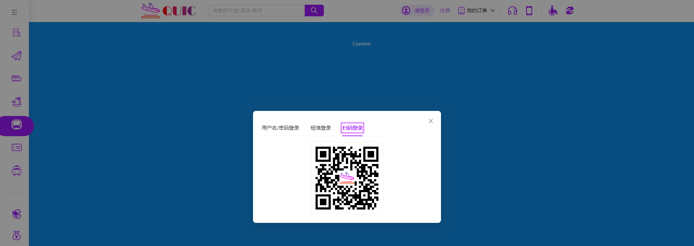
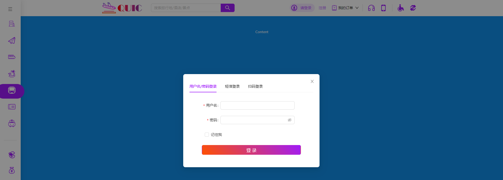

#### 信息栏

实际上这个部分就是位于整个布局的`footer`部分，实现起来也很容易，这部分也可以采用多栏布局，组件是`footer`页文件夹中的`Info`。

多栏布局采用`import { Col, Divider, Row } from 'antd';`实现，各个部分可以设置不同比例，例如最后一列是前面两列的一倍宽，文字部分每个标题下面是两个列表，均分宽度。

这里注意下部的页面大部分内容可能都是从后端调出来的，可以用 js 代码实现列表的渲染。

实现效果：
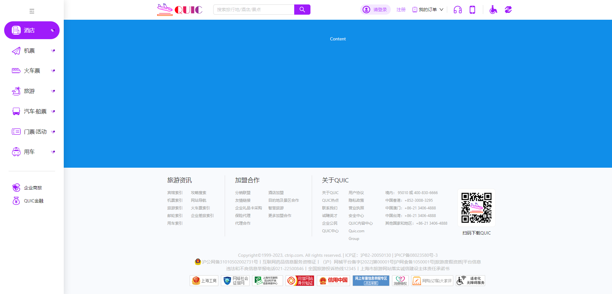

#### 无效链接

这里需要用到`Nextjs`的特性，想要自定义 404 页面，可以直接在 pages 页面上创建`404.js`文件并返回想要的组件效果即可，实现效果：

### 主要功能页面

这些页面就需要写在`pages`文件夹中了，因为可以利用其路由特性在不同页面之间进行跳转，由于内容部分和上面工具栏分不清，因此工具栏设置了一个浅色下边框。

在创建所有页面之前，我们需要测试导航栏的导航功能，先将所有页面创建出来，先实现路由功能，这里还要添加一个通用页面，对于那些没实现详细页面的导航来说，都可以展示通用页面。

`nextjs`似乎做不到页面内的导航，只能用点击导航传参给父组件的方式进行导航切换了。

确定导航可以成功切换，可以开始开发页面了，每个页面相关的组件会放入到 pages 内对应的文件夹中：
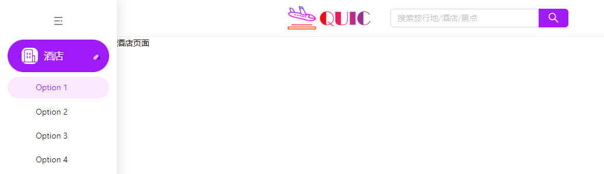

#### 酒店页面

酒店页面在`pages`文件夹内，名为`inn.js`。整个页面可以分为
预订酒店、大轮播图（别的页面也有，可以提取为公共组件）、小轮播图、酒店推荐模块、当季热推模块和探索精彩世界模块。

组件名称列表：
| 模块名 | 组件名 |
| :------: | :----------------: |
| 预订酒店 | Booker |
| 大轮播图 | BigBanner |
| 小轮播图 | SmallBanner |
| 酒店推荐 | RecommendInn |
| 当季热推 | SeasonRec |
| 探索精彩世界 | Explore |

**整体布局：** 整体上为两个大的部分，左侧长条的内容和右侧吸顶大 banner 图，这两大块的布局准备利用两个`div`盒子实现`flex`左右双栏布局，且全局滚动条比较丑，样式也可以修改，效果如下：

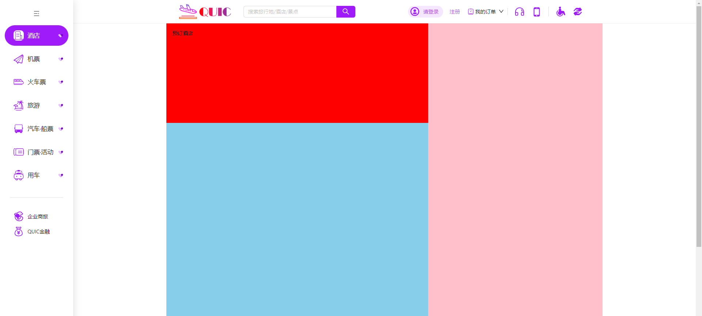

**预订酒店：** 模块难点在于城市选择器的使用和入住、退房时间的选择，入住和退房比较简单，直接用日期选择器组件即可，但是城市选择器似乎比较麻烦，奇妙的是，原始网站设计中，4 个有选择器的页面竟然选择器长得都不一样，为了提高可复用性，这里直接将选择器写为公共组件`CityPicker`。

**城市选择器：** 城市选择器组件利用`antd`当中的级联选择来实现，因为页面数目较多，==抽取组件可增强可复用性==，城市选择器可通过输入参数的方式初始化，`global`参数控制是否展示国际城市，例如机票就需要，但是火车票不需要。

**日期选择器：** 比较容易实现，而且每个页面中样式不同，可以复用后修改样式，也可以直接重写。这里有个小细节需要手动实现，要==计算选中日期的天数并显示在面板上==。时间选择器中间的分节符显示天数，同时面板默认为当前时间可以用`moment`包实现。而且设置组件参数不允许选择今天之前的房间。

**订房信息：** 同样用表单的方式，但似乎表单项都是 flex 排布的……

**房间住客选择器：** 可以用`Popover`组件结合按钮进行设计，输入框内容不可修改，输入框 icon 随点击而发生改变，弹框内容改变时，按钮上的字样也随之改变。

**酒店选择器：** 也是下拉菜单，但是好像有一个自定义页脚。

**关键词：** 简单输入框。

效果展示：
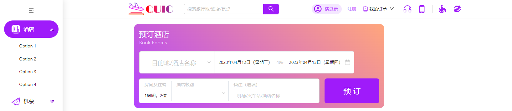

##### 小轮播图

小轮播图直接用走马灯组件即可，样式需要修改很多，因为小 banner 用的很少，样式也不统一，这里就不抽取公共模块了。但是样式是覆盖全局的，因为所有的 banner 基本上点点的样式都是一样的。

##### 大轮播图

大轮播图原理和小轮播图一样，但是轮播图除了图片还有一些其它信息，可以通过定位的方式放在每张轮播图上，但是数据是从后台取出来的，需要用 js 实现数据粘贴，不能写死。

其次大轮播图要实现一个吸顶效果，这里用`position: stickey`实现，但是当屏幕滚动到父元素外部时吸顶失效，需要用 js 实现。

效果展示：
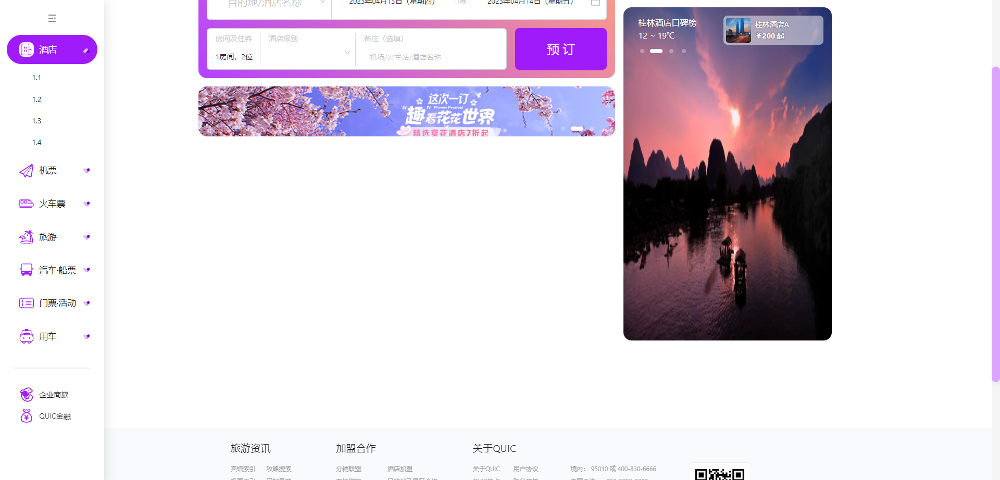

##### 推荐板块

这个板块可以认为下面滑动的部分是走马灯组件，上面城市选择可以看作一个分段控制组件，上面组件变化能导致下面列表内容发生变化，这个部分也是直接对后端反馈的数据进行处理即可，当上面滑块的 token 变化后，变化的只是这六个`li`的内容。格子内的内容超出边界需要添加...，用纯 CSS 实现。

效果展示：
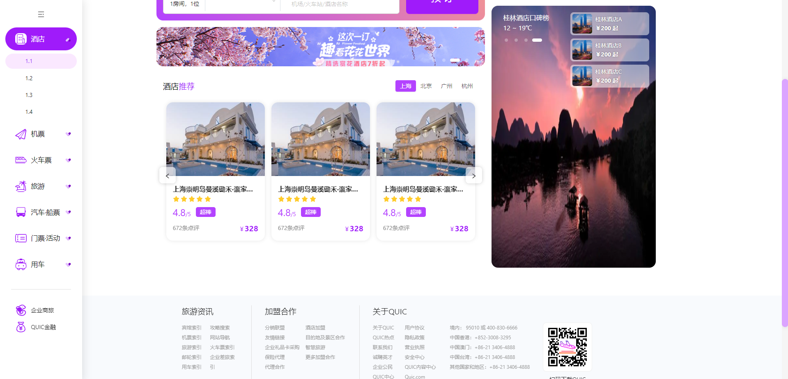

##### 当季热推

此板块头部和推荐模块相同，直接复制即可。下部显然是两个 list，内容布局也比较简单，鼠标 hover 时有强调效果。
这里比较有趣的是左上角的 png 图，通过定位放上去的，而且整个 pannel 具有背景色。效果展示：
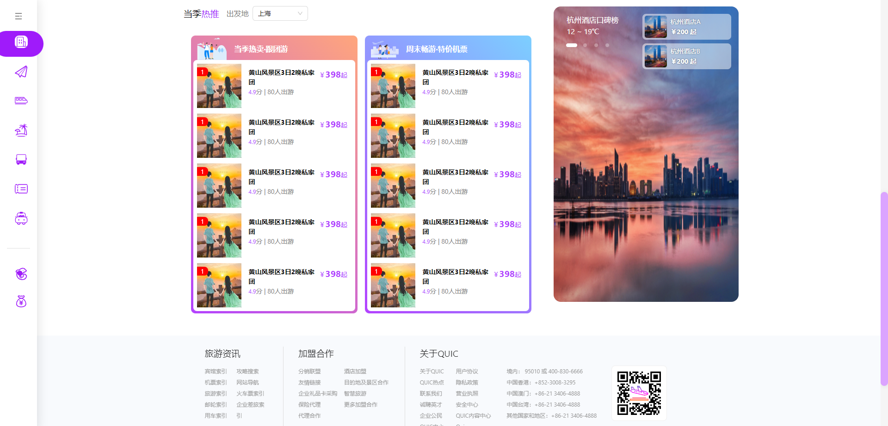

#### 机票页面

这个页面只设计两个组件：`PlaneBooker`和`PlaneBanner`，对应上面购买机票和下面的大轮播图。

##### 机票购买模块

这个模块仍然涉及表单的使用，而且架构比较复杂，这个模块可以通过修改 tab 的 label 样式改变整个页面，长度不是很好调整。

##### 轮播图

简单的轮播图，操作和之前相同。

#### 汽车票页面

此页面较为简单，布局可分为上下两个部分，两个部分都是左右布局左上角购票栏除了 tab 组件和表单外，似乎没有其它的组件了。
此页面只有一个组件，名为`boatBooker`。
效果展示：
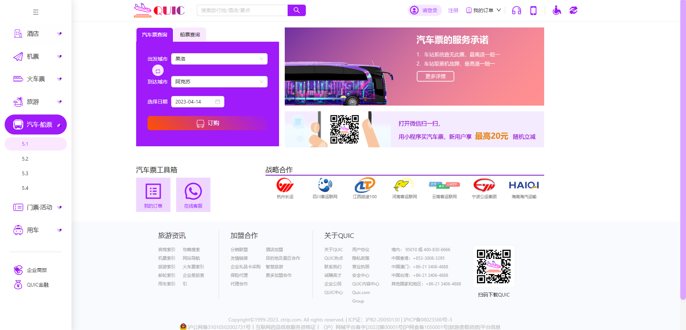

#### 火车票页面

火车页面包含组件稍多，组件信息如下：
| 模块名 | 组件名 |
| :------: | :----------------: |
| 预定火车票 | TrainBooker |
| 优惠酒店 | CheapInn |
| 坐火车去旅行 | TainTrip |
| 热门路线 | TrainHot |

**预订火车票：** 组件和之前机票、酒店等页面组件十分相似，主要是外观上的改变，城市选择器依旧复用之前的，后面日期的部分由两个选择器组成，每个选择器也要注意国际化，且通过按钮和 state 实现隐藏显示第二个选择器的功能，效果如下：
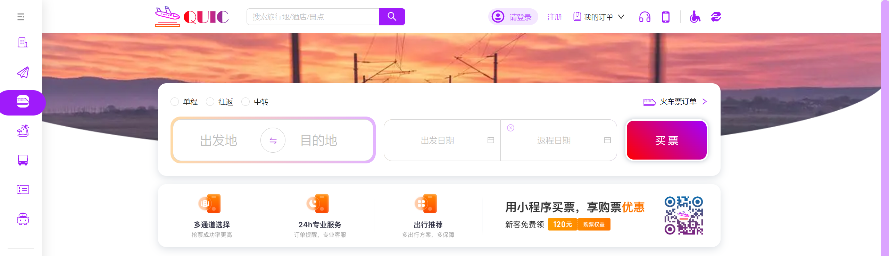

要注意的是，优惠酒店和热门路线两个组件上部的选择器一样，因此可以抽象出一个火车页面专用的公共组件`TrainSelector`，该组件可以传入城市列表，并渲染出可以点击选择的效果。

**公共选择器组件**：先根据数据渲染列表，鼠标点击时能够改变 ind 并添加 class。效果展示：
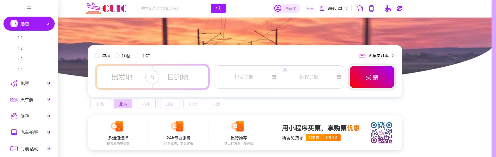

**优惠酒店模块：** 利用刚才写好的公共选择器，和之前的逻辑很相似，效果：
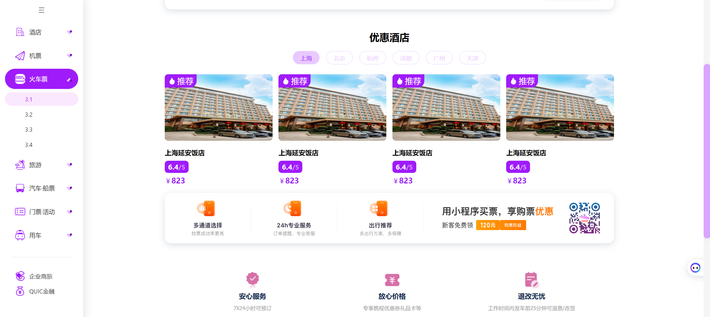

其它模块同理，这里就不一一展示了，展示一下最后的效果：
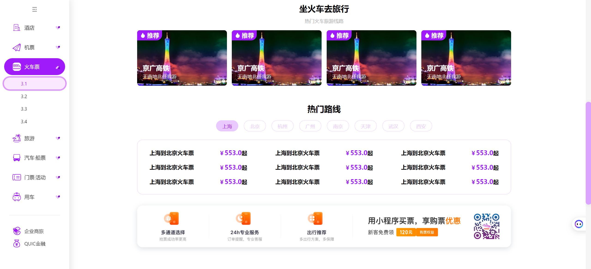

#### 旅游攻略页面

此页面内容也不是特别多，主要是大量数据列表的渲染和分页组件的使用，整个页面仅设计下面的列表组件`TripShare`即可，组件和布局也不是很复杂。这里其实不知道后端是否负责数据的处理，一般来说获得的数据不应该是字符串，也没有逗号分割，最后一定需要在渲染前处理，因此效率也可能是比较严重的问题。
效果如下：
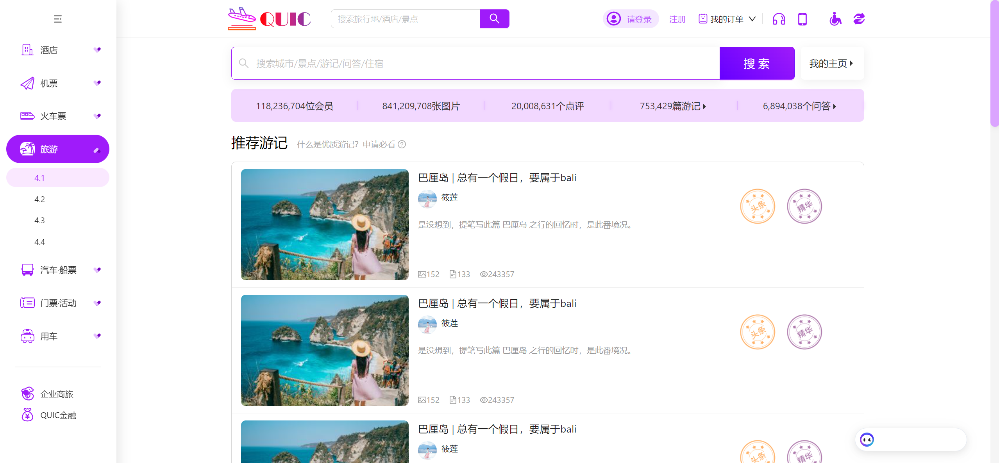

#### 注册页面

注册页面同样点击注册按钮弹出弹窗，弹窗内可设置用户名、性别、邮箱、旅游宣言、密码和确认密码。
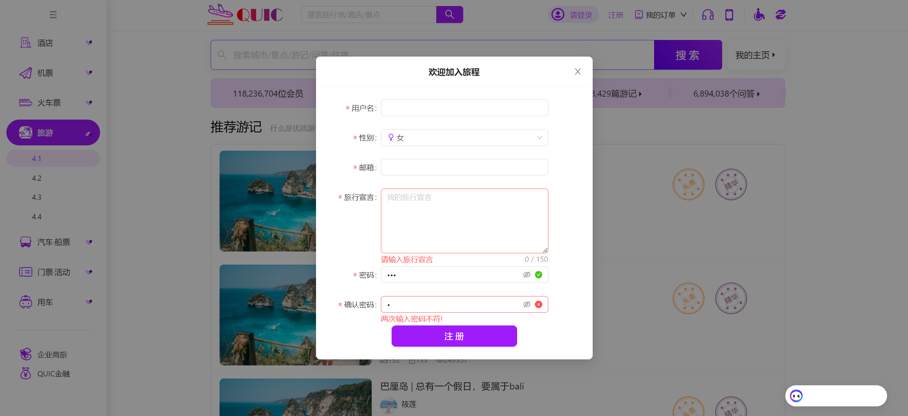

#### 我的订单

订单页面上部显示用户名和个人信息，下部共五个部分，可以用五个卡片做，对应酒店、机票、火车票、汽车票和船票订单。每个订单单独处理，从服务器请求 API 获取对应数据，这部分数据从数据库根据用户信息获取。

#### 普通页面

只有一张图片，用来给没有开发出外观的页面占位，提高用户体验，效果展示：
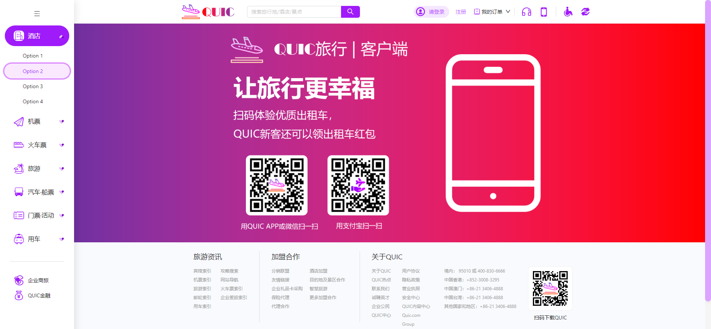
